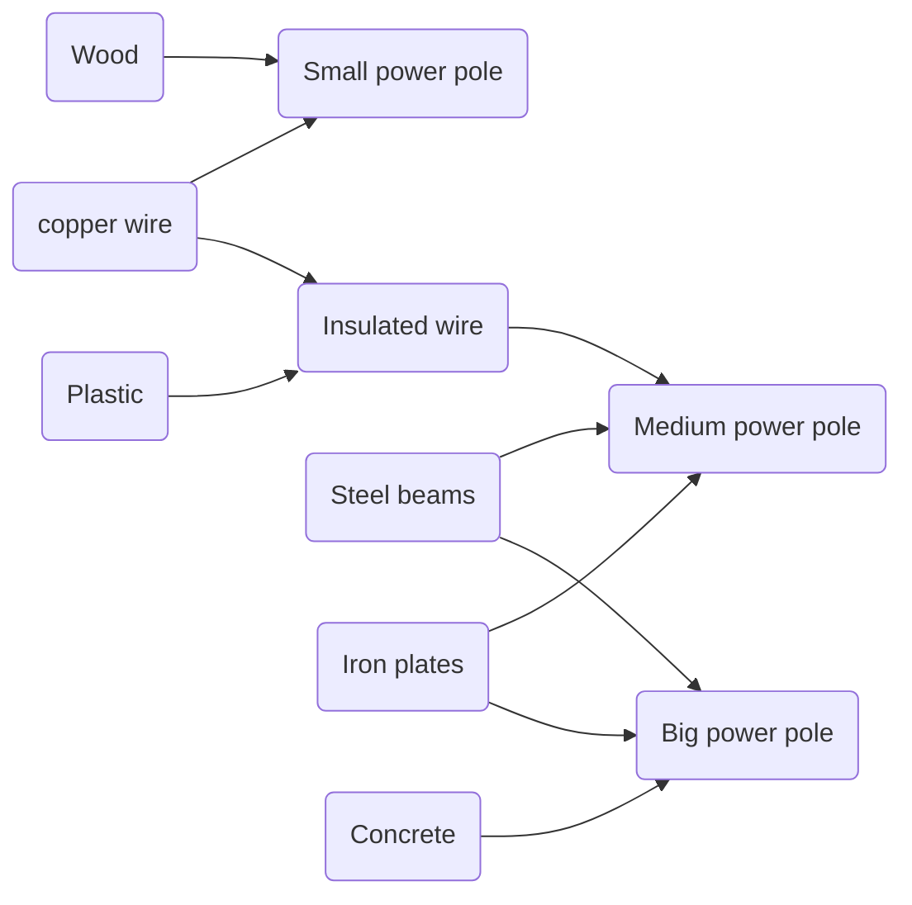
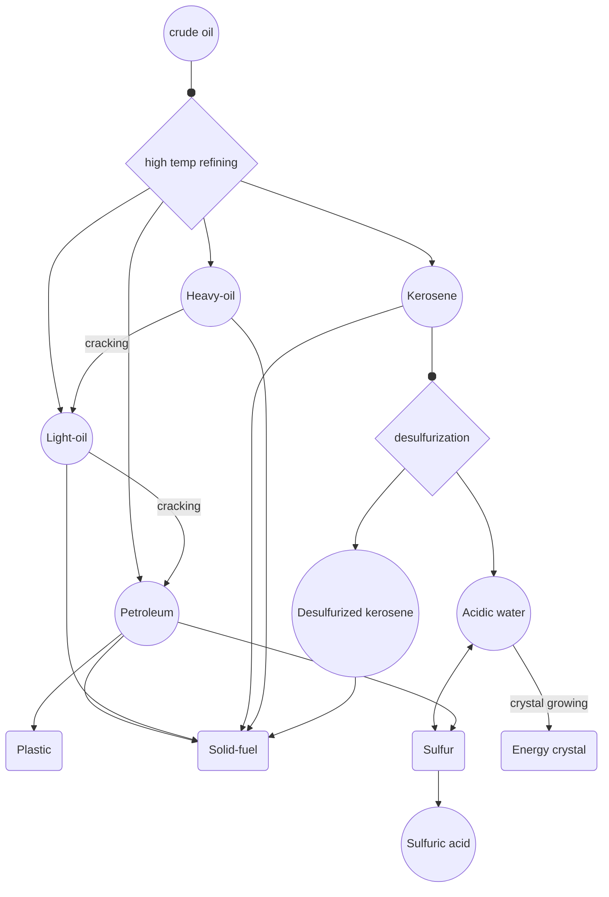
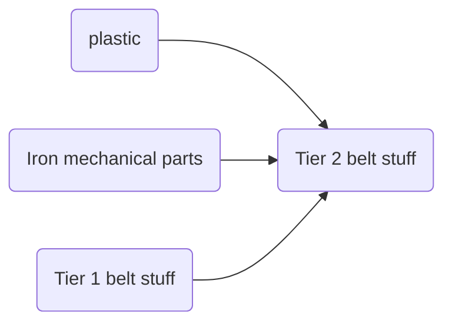
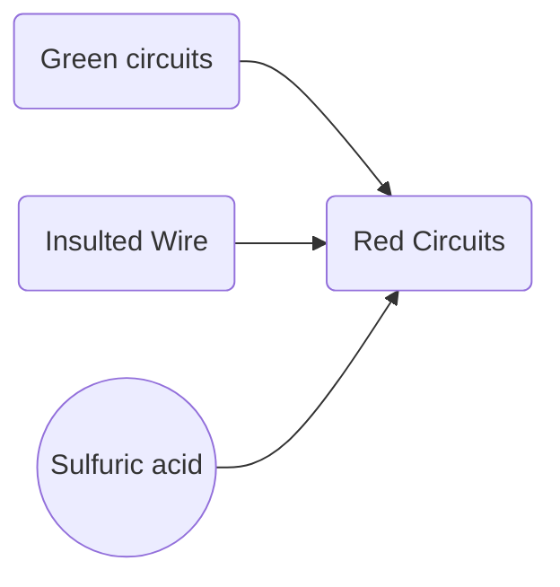
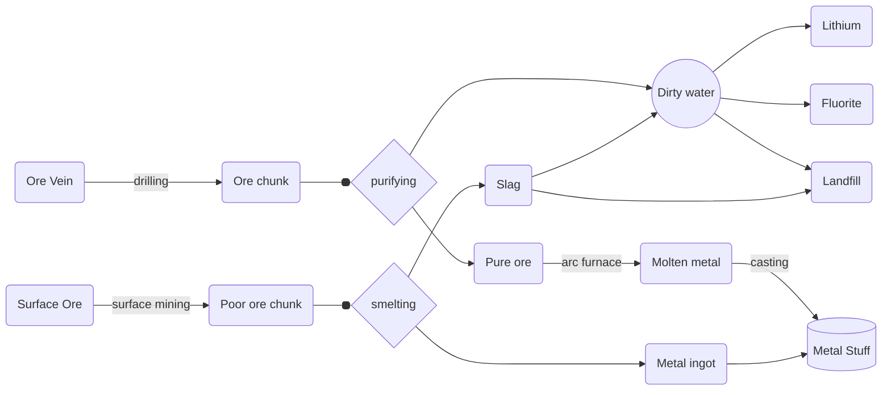
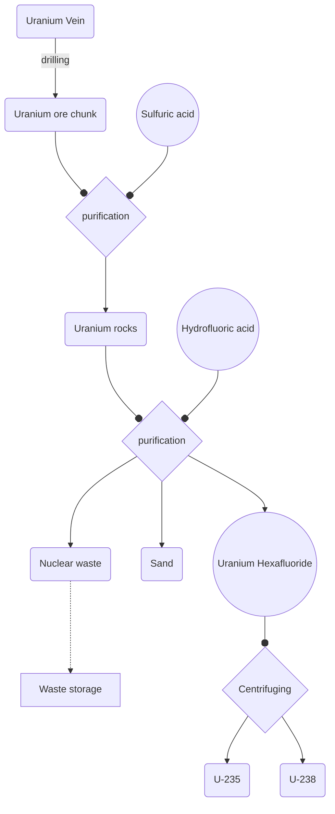
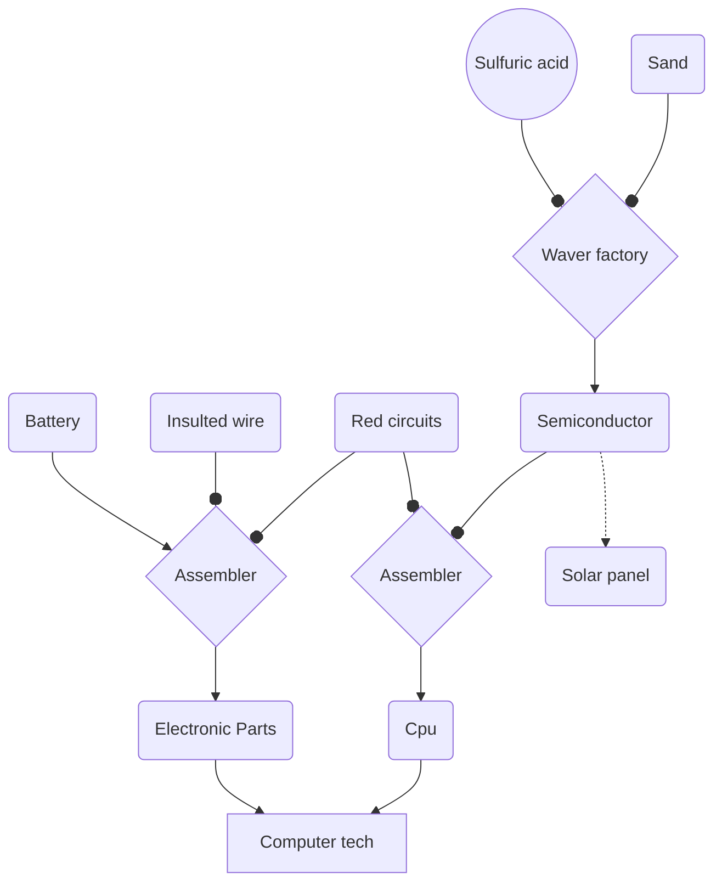

# Age of electricity

The age of electricity is where the mid game starts.
Power can first be produced using steam ofc in the `steam engine`.
`Assembling machine 1, chemical plant, pumpjack, lab...` all electrical become available.

**NOTE: Fuel values of stuff will be tweaked to make using oil for power generation suitable. Only using coal will most likely not be enough. Oil depots however should be tuned to have increased yield.**

The goals of this age are mainly `electrification`, `advanced chemistry` and `basic deep mining`.

One of the most important components besides `green circuits` in this age are `electric engine units`. They can be made without lubricant at first. However later a recipe, using lube, will be more efficient. Electric engine units will be needed for nearly every mechanical machine powered by electricity.

All three types of `power poles` can be made from relatively early on. However where the small power pole only needs wood and copper cable the medium one will require insulated wire and and the big power pole insulated wire and concrete.

Circuit network can be researched at this point.

The `advanced chemistry` part will enable cracking. A new oil refinery will be available: the `High temp oil refinery`. Using 500dec oil can now be separated into `petroleum, light-oil, kerosene and heavy-oil`. The 500dec heat can be produced with advanced solid heaters burning only `solid fuel or coke pellets`. Both heated oil refineries will be able to desulfurize the kerosene into `desulfurized kerosene` and `acidic water`. Like in 248k diesel fuel will be made out of the desulfurized kerosene and acidic water gets turned into `sulfur`. There will also be options to turn both kerosenes into solid fuel.

# Early bots

`Batteries` made out of `sulfuric acid` are needed for `basic roboframes`. Roboport and **all** robochests are available. Tier 1 cargo bots start with 10 cargo capacity but are slow af and suffer from small batteries, making them ok for robot based malls but horrible for long/medium range transportation. Tier 1 building bots are faster but still slow. They will have only 1 cargo capacity but in term use less energy making them stay in the air for a longer time with the same battery size.

# Diesel Train

The vanilla train will be named diesel train and can get built at this point. It will only take diesel fuel. And come with an equipment grid. Later in this stage one will get access to equipment like turbocharger and train electricity generator.

Acidic water will once again enable the growing of `energy crystals` in a kovarex style. However the first crystal won't be obtained by purification of ore but using `electric energy injection` on lithium with a small chance of resulting in a crystal. The crystals will follow pretty much the same upgrade path as in 248k and can be charged to produce the better `diesel fuels`. 

#

`Plastic bars` can be produced using stuff from the steam age and will be needed to create `tier 2 belts`.

`Red circuits` will open the gate towards `substations` and `basic deep mining`.
They will be made out of `green circuits, insulated wire and sulfuric acid`. The player will need to setup proper oil management to produce a steady amount of those items.

With drilling `Iron, copper, coal, lead, uranium and sulfur veins` can be harvested. The drill buildings will consume `drill items` as in 248k. At this point `arc furnace, metal caster and purifier` can be built. They will purify the `Ore chunks` obtained into `pure ore` producing well known dirty water as byproduct. These pure ore chunks and **all** other metal intermediate components like `ingots, beams, mechanical parts and plates` can be molten in the arc furnace. The casting machine will allow casting into ingots or plates/beams. Dirty water turns into landfill, lithium, fluorite or water.

Uranium washing will be way more resource intensive and has a very low output. Uranium 235 fuel cells can be made and the vanilla nuclear reactor, however the reactor power output will get nerfed. Most fission based buildings will be needing lead.

Uranium can be drilled as the other ore veins, and needs to be purified using sulfuric acid to `uranium rocks`. Using `hydrofluoric acid` pulverized uranium rocks can be separated into `uranium hexafluoride` and sand with `nuclear waste` as an unwanted byproduct. `Nuclear waste` can be put into `castor buildings` as in current 248k. Uranium hexafluoride can be centrifuged into U-235 and U-238. Fuel cells can be crafted using both and lead.

# Semiconductors

The last part of the electrical age is concentrated on making `semiconductors` to be used for the `computer tech`. Solar panels can be built using semiconductors for power generation. They will be buffed to be a reasonable alternative to nuclear.
Lithium can also be used for making batteries in an alternative recipe. Sand and sulfuric acid will be turned into semiconductors in a `Waver factory` requiring huge amounts of power. Those and red circuits can be crafted into `cpu` items, which are used to make computer tech. `Electronic parts` summarize most electronic non semiconductor items, and will be needed for later module, beacon and overall computer associated crafting. 

