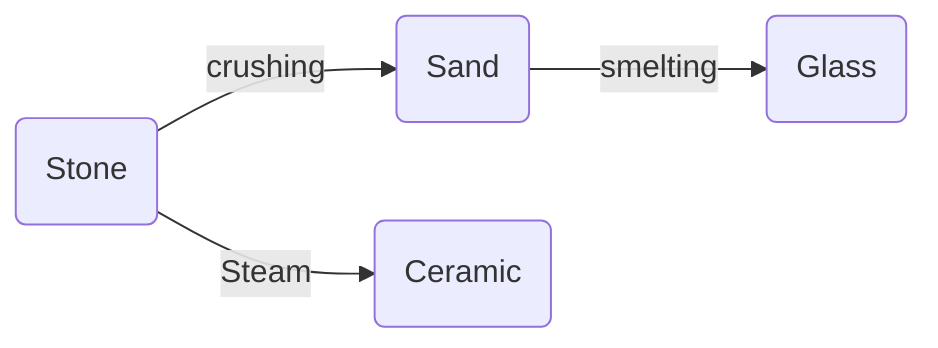
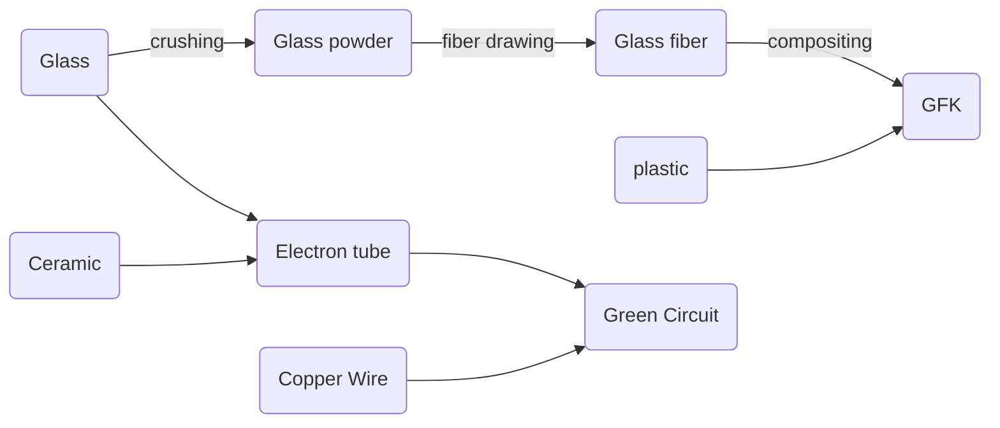
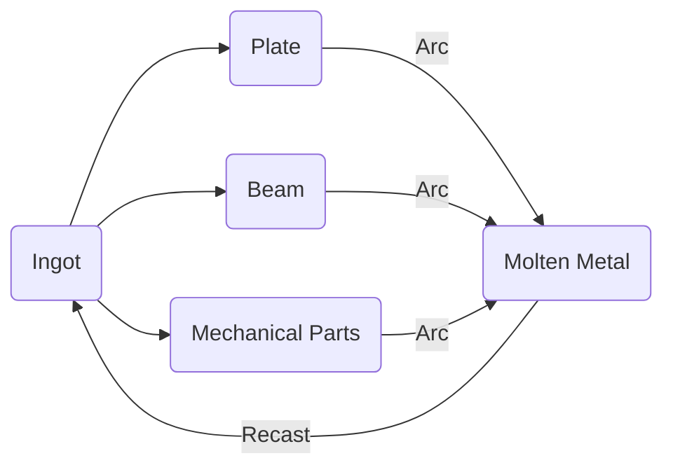

# Planned progression

The player starts as in usual factorio, however electricity won't be accessible from the start.
The mod will be structured in Ages similar to 248ks Stages but with more overall impact on the game and challenges:

- Steam Age
- Electricity Age
- Semiconductor Age
- Quantum Tech Age
- Exotic Age

# Science

Science packs will change from the vanilla ones (logistic, automation, chemical, production, utility and space) to one associated with each age.

1. Steam Tech
2. Electricity Tech
3. Computer Tech
4. Quantum Tech
5. Exotic Tech

`3` different Lab tiers will be available using different sciences (using above indices)

# Resources

Resources will see some changes. Materials used in the early Ages can be found very easily as `surface ores` (normal ores as in current vanilla). Drilling spots can be found on the map resulting in `pure material chunks` or `mixed material chunks` which can be processed to both rare metals and also surface materials.

`Oil` and `natural gas` can be pumped as in vanilla.

`Stone` can be mined from **everywhere** on the map using a stone miner (maybe with the sprite of the old vanilla miner).

Here is a first draft of the minable materials:

1. **Minable Everywhere**
    - Stone
2. **Surface Ore**
    - Iron
    - Copper
    - Coal
3. **Deep Ore**
    - Coal vein
    - Copper vein
    - Iron vein
    - Sulfur vein
    - Titanium
    - Gold
    - Neodymium
    - Lead
4. **Deep fluids**
    - Oil
    - Natural Gas
5. **Space Ore**
    - Exotic Matter
6. **Only byproduct from washing**
    - Lithium
    - Fluoride

Surface ores can be directly smelted into their `ingot` form. Washing need to be applied to the `deep ore chunks` to get them sorted and extract the raw materials, however it can also be used on surface ores for higher outputs.

Here are a few usages examples of these materials:

Production chains will get more attention to detail in documents dedicated to each stage, which can be found in this repo.

# Component system

I intend to implement a component system for each of the above materials.
Processing an ore using different ways always will result in an ingot of the material. These ingots can be turned into `plates`, `beams`, and `mechanical parts` (an item combining gears and sticks and so other mechanical stuff).

Later when `arc furnaces` and liquid metals are available turning processed materials back into ingots will be possible. 

Besides the more mechanical component the player will also need to make `electronic components`, `high-tech components` and special `rocket parts`, which are all important items.