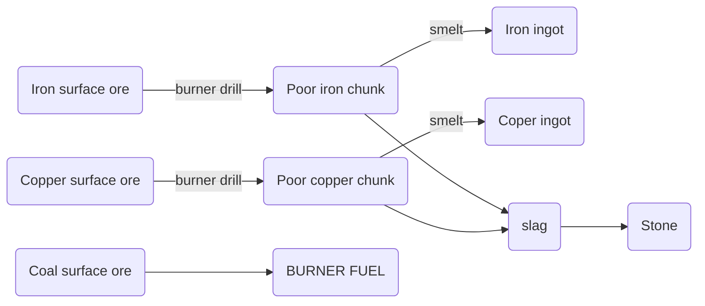

# Start Age (no better name atm)

The player starts similar to vanilla factorio.
`burner inserter`, `burner mining drill`, `stone furnace`(0.5 crafting speed, high energy usage, high pollution) and `starter lab` are available from game start. There is explicitly nothing with electricity, logistic (like belts) and automation (assemblers) in this age.

# Materials

`Iron`, `Copper` and `Coal` are the three surface ores that can be mined, mining `Iron/Copper` will result in `poor quality ore chunks`. Smelting them in the stone furnace results in `Ingots` and `Slag`. `Slag` can be turned into stone for new furnaces. `Iron/Copper mechanical parts` can be used to craft `Steam Tech` which will unlock the next age.

# Progression

