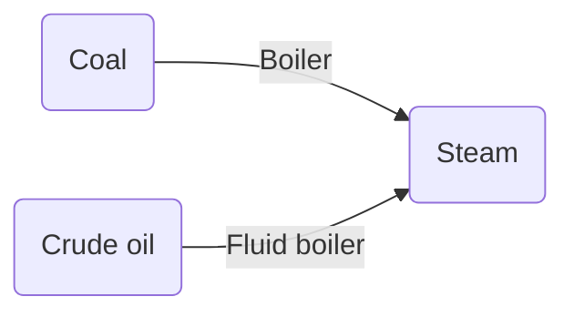
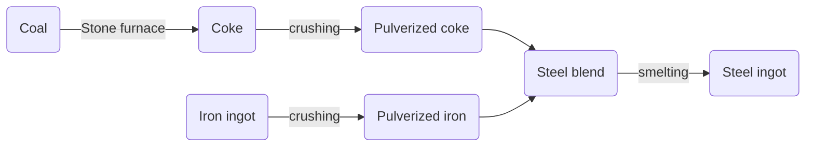
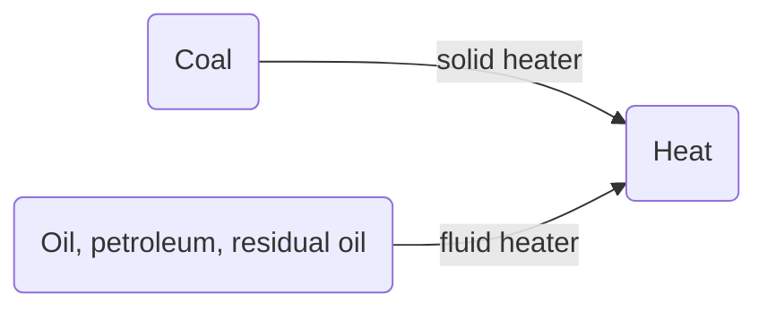
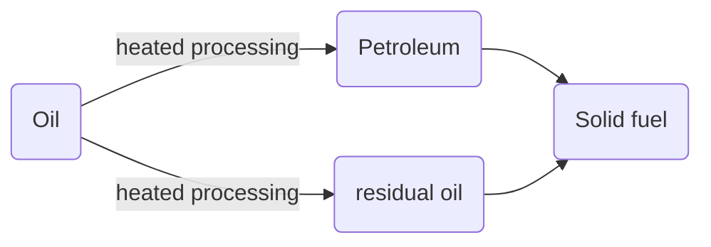
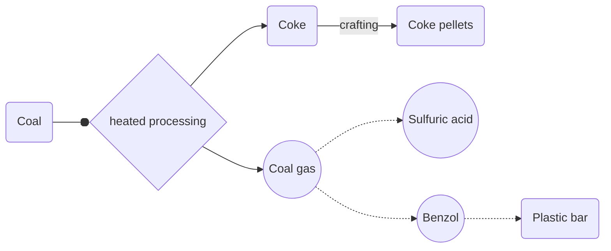
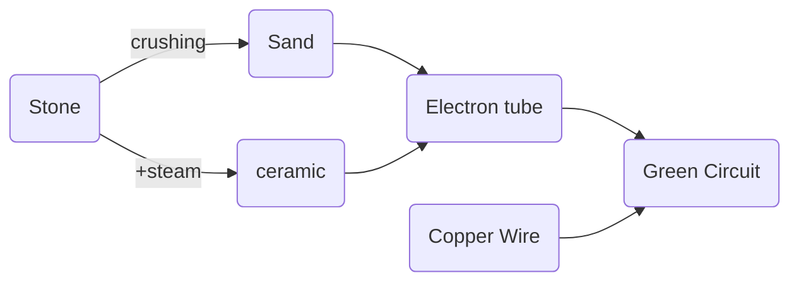

# Steam Age

Steam age is the first real age of the mod. Main objectives are `automation`, a stable `steam/fuel` production and `steel` production (in this order).

**Deep ores are still not available in this age.**

Using iron and copper ingredients as well as stone from starter age `steam assembler, steam crusher, steam boiler, pipes, steam inserter, fluid tank and belts` can be build. All buildings mainly being based on `iron mechanical parts`.
Also a `stone miner` can be build (the one using the old miner graphic), that can mine stone from everywhere on the map. Since `Slag` is still being produced by `poor ore chunk smelting` the player can turn the excess stone into `stone bricks` for road paving.

Using stone and iron **railway tracks** can be build, however without proper signaling yet. A `basic steam locomotive` and a `cargo wagon`, both slow and heavy are available. (probably with wonderful textures from YuokiTani's YIR mod)

The `engine unit` will be renamed into `steam engine unit` and will be used in most of the steam related machines.

`Steam production` balances this age around `fuel` production. In the middle of this age `steam powered pumpjacks` (if possible with API) can be used to `pump crude oil` and burn it to produce steam in a `fluid boiler`.

Coal processing to coke can then be unlocked. This will `decrease` the total fuel value by **30%**, since byproducts (gases) are lost in the furnace. However turning coke into coke pellets increases the fuel value again by **20%**, still an overall loss. This is needed to produce the first steel ingots.

Throughout the mod different methods to create steel can be used (based on used metals for alloying), where better methods create noticeably more steel. The first steel ingots are made of smelting `steel blend` in the stone furnace. Steel blend is made of pulverized iron and coke.

`Steel furnaces` (2.0 crafting speed, medium energy usage, medium pollution) are significantly better then `stone furnaces`. Using steel a cheaper recipe for rails is available, as well as an upgrade of the basic steam locomotive and wagon (also a fluid wagon is available). Chain and normal signal is now craftable.
Since oil can now be transported there will be a small early oil processing. An `fluid fuel heater` can be built, turning fluids with burn value into `heat`, ofc there is also a `solid fuel heater` (plus basic heat pipes) [both up to 200dec].

This heat poweres an oil facility to process `crude oil` into `petroleum` and `residual oil` or turn `coal` into `coke` but with `coal gas` as byproduct. `Solid fuel` can be produced from `petroleum` and `residual oil`.

    residual oil sums light oil, kerosene, heavy oil and lubricant since 200dec are not hot enough to separate these from another

The coal gas has a medium fuel value, making it usable in fluid boiler/heater. In the next age a recipe will be available to produce `sulfuric acid`(small portions) and `Benzol`(used to make plastic) from coal gas.

Cracking is not available in this age. The entire oil processing is not necessary to complete the steam age but will provide enough fuel to power the factory in this stage at the cost of transporting oil from possibly far away and processing it using heat. A (little) heat infrastructure will be needed later in the mod anyways.

# Flux Tech (or electricity Tech or so)

Flux tech will be needed for the next age. Crushing stone results in `sand`. `Ceramic` can be produced with steam and stone. In the next age a recipe using `sand` and less `steam` can be researched. `Glass` will be produced from smelting `sand`. Using both items `electron tubes` (very much from little ceramic and glass) can be produced and from that `green circuits`, those are needed to make flux? tech to progress towards the next age. Nothing else uses `green circuits` in this age ofc, that wouldn't make sense.

