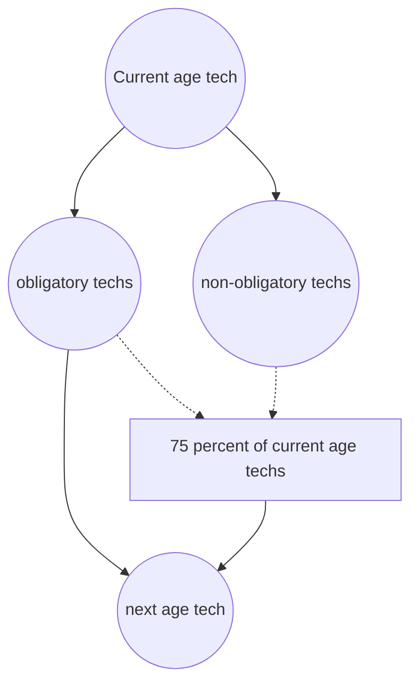

# Tech progression

Tech progression will be different in `Exotic Industries` compared to vanilla. Each section of the tech tree will be divided into the mods ages. With each age having a special age tech, witch can not be researched with labs right away. In order to enable the next age tech the player must do 2 things:

1. Have all obligatory techs in the current age already researched (about 50-75 percent of all techs in that age)

2. Have 75 percent of all techs from the current age researched, including obligatory and non-obligatory tech (ony techs with a certain `Counting` tag will count, this will exclude techs added by other mods)

# Tech scaling

Science cost will also see some changes. At the start of the game `every` technology (available and unavailable) will require 100 science. This cost will `increase with every researched tech` linearly up towards the last tech (excluding infinite techs).

This means, that the player may choose to `rush` a certain technology
f.e. bots will then however need more science to research better energy production.
